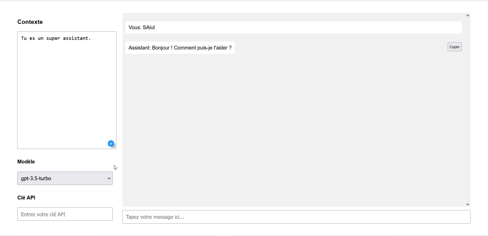

# ChatGPT-interface
ChatGPT interface, GPT3.5 et GPT4

Une interface simple pour interagir avec l'API d'openAI : GPT3.5 et GPT4. Avec le context sur le coter gauche.

Lance le index.html et enjoy.

Mes liens :

Chaine youtube : https://www.youtube.com/channel/UCNFED93Cb1U6-QnrVXZlBkw

Forum : https://forumentrepreneurweb.fr/

Formation : https://devenirentrepreneurweb.fr/formations/
